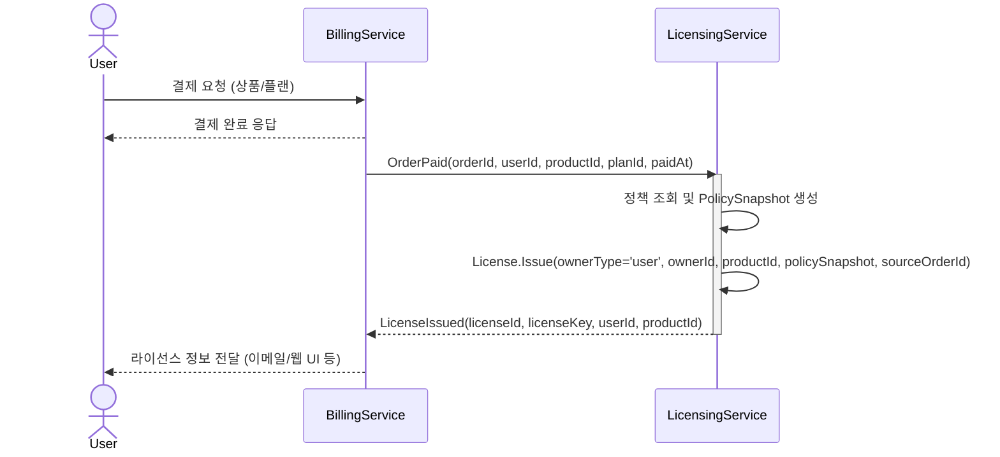
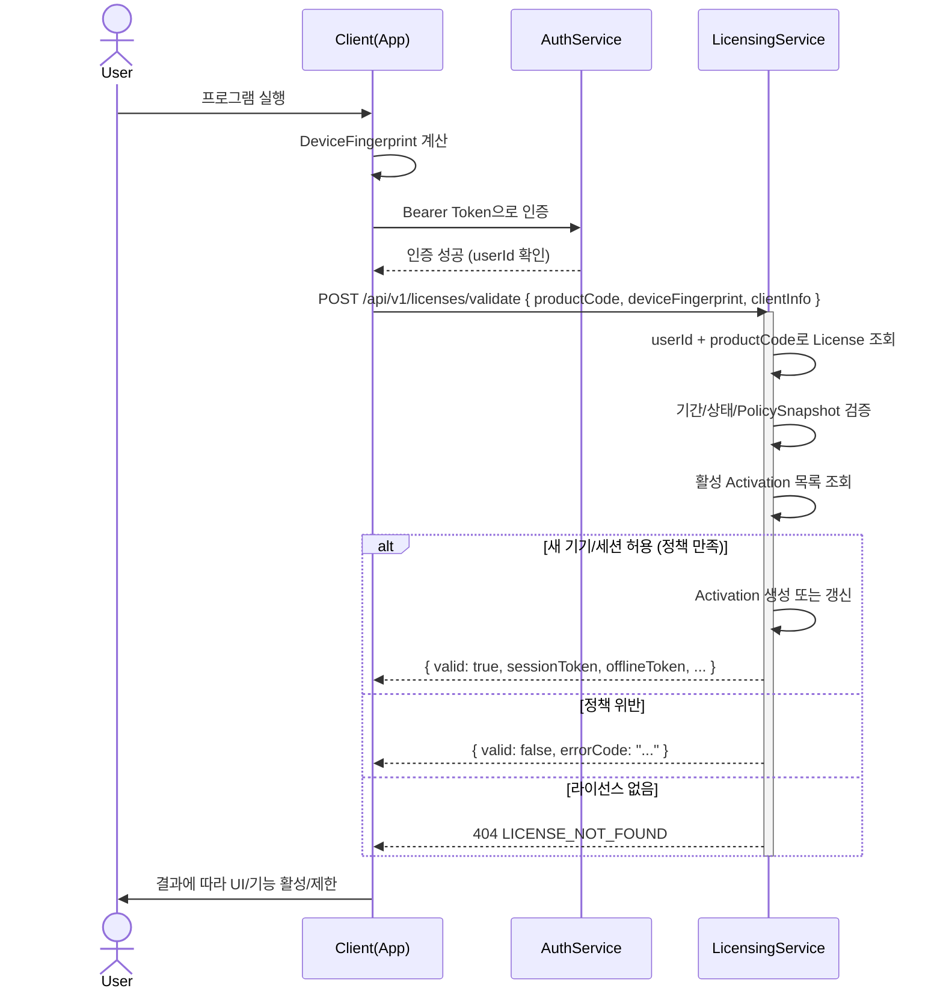
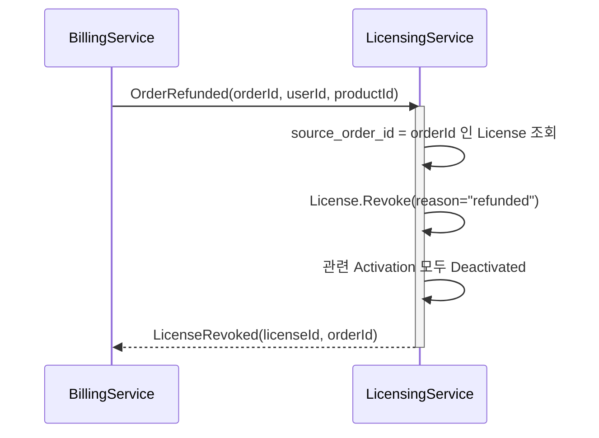

# BulC Homepage 라이선스 도메인 설계서

| 항목 | 내용 |
|------|------|
| 문서 버전 | v1.0 |
| 작성일 | 2026-02-25 |
| 프로젝트명 | BulC Homepage |
| 시스템명 | METEOR 화재 안전 시뮬레이션 플랫폼 |

---

## 변경 이력

| 버전 | 날짜 | 변경 내용 |
|-----|------|----------|
| v0.1.0 | 2025-12-08 | 최초 작성 |
| v0.2.0 | 2025-12-17 | 계정 기반 API 지원을 위한 도메인 메서드 추가 (IsOwnedBy) |
| v0.3.0 | 2026-01-08 | Auto-Resolve + Global Session Kick UX 설계 반영 |
| v1.0 | 2026-02-25 | 문서 컨벤션 통일, 타 문서와 중복 내용 정리 (ERD → 시스템_아키텍처/테이블정의서, Redeem 테이블 → 테이블정의서 참조), Redeem 코드 도메인 반영 |

---

## 1. 개요

본 문서는 BulC Homepage 라이선스 시스템의 **도메인 설계**를 정의합니다.
초기 릴리스에서는 **개인 라이선스 + 기본 Billing 연동**만 구현하며,
향후 **조직/교육기관(Organization) 라이선스**로 확장 가능한 형태를 목표로 합니다.

> **관련 문서:**
> - 데이터 모델(ERD, 테이블 정의): [테이블정의서](테이블정의서.md), [04_시스템_아키텍처](04_시스템_아키텍처.md)
> - API 상세 명세: [라이선스 API 정의서](licensing_api.md)
> - 전체 API 목록: [05_API_정의서](05_API_정의서.md)

### 1.1 목적

- 결제 완료 시 **라이선스 발급**.
- 사용자가 **여러 기기(집/회사/노트북)를 편하게 오가며 사용**할 수 있는 라이선스 모델 제공.
- 단순 Key/Seat 모델보다 진보된 **계정 기반 + 기기 슬롯 + 동시 실행 + 오프라인 유예** 모델 구현.
- 향후 **조직/교육기관(Org)용 라이선스** 추가를 고려한 도메인/스키마 설계.

### 1.2 범위 (v1)

- **포함:**
  - 개인 사용자(User) 기준 라이선스 발급/검증/활성화.
  - Billing/Payment와 연동된 라이선스 발급 (OrderPaid → License Issue).
  - 기기 단위 활성화(Activation), 동시 실행/오프라인 유예 등 정책 적용.
  - 리딤 코드 기반 라이선스 배포 (캠페인 관리).
- **제외 (향후 확장):**
  - Organization / OrgMember / OrgLicensePool / Course/ClassGroup / LicenseAssignment 등 단체/교육 기능.
  - 복잡한 리포팅/감사(Audit) 기능.

---

## 2. Bounded Context 및 외부 연동 관계

### 2.1 Licensing Bounded Context

**Licensing BC의 책임**

- 라이선스 라이프사이클 관리:
  - 발급(Issue), 활성화(Activate), 검증(Validate), 만료(Expire), 정지/회수(Suspend/Revoke).
- 정책 및 제약:
  - 라이선스 종류(Trial/Perpetual/Subscription).
  - 기기 수 제한(`MaxActivations`), 동시 실행 제한(`MaxConcurrentSessions`).
  - 오프라인 허용 기간(`AllowOfflineDays`).
  - Entitlement(사용 가능 기능/모듈 목록).
- Activation/Device 기반 사용 현황 관리.

**Licensing이 참조하는 외부 BC**

- **Auth/Account BC**
  - `UserId`, `Email`, `TenantId` 등 사용자 식별자.
- **Billing/Payment BC**
  - `OrderId`, `UserId`, `ProductId`, 결제 상태 등.
  - Licensing은 `OrderPaid` / `OrderRefunded` 이벤트(또는 API 호출)를 입력으로 사용한다.
- **Redeem BC**
  - 캠페인 기반 코드 발급/Claim 시 LicenseService 직접 호출.

---

## 3. 도메인 모델

> 테이블 스키마 및 ERD는 [테이블정의서](테이블정의서.md)와 [04_시스템_아키텍처](04_시스템_아키텍처.md)를 참조하세요.

### 3.1 Aggregate: License

**의미**
특정 Owner(개인/조직)가 특정 Product/Plan을 특정 정책 하에 사용할 수 있는 **사용 권리**.

**핵심 필드**

| 구분 | 필드 | 설명 |
|------|------|------|
| 식별/소유 | `LicenseId` (UUID) | 라이선스 고유 식별자 |
| | `OwnerType` | `'user'` (v1), 향후 `'org'` 추가 예정 |
| | `OwnerId` | `users.id` (v1) |
| 대상 | `ProductId`, `PlanId` | 제품 및 플랜 참조 |
| 타입/정책 | `LicenseType` | Perpetual, Subscription, Trial |
| | `PolicySnapshot` | 발급 시점 정책 스냅샷 (JSON) |
| 기간/상태 | `ValidFrom`, `ValidUntil` | 유효 기간 |
| | `Status` | Pending, Active, Expired, Suspended, Revoked |
| 추적 | `SourceOrderId` | Billing 주문 ID |
| | `SourceType` | PAYMENT, REDEEM, ADMIN |

**주요 도메인 메서드**

| 메서드 | 설명 |
|--------|------|
| `Issue(...)` | 주문 정보 + 정책 기반으로 License 생성 |
| `Activate(deviceFingerprint, clientInfo, now)` | 정책/기기 슬롯/동시 실행 제한 고려하여 Activation 생성/갱신 |
| `Deactivate(activationId or deviceFingerprint, now)` | 특정 기기/세션 비활성화 |
| `CanActivate(deviceFingerprint, now)` | 새로운 활성화 허용 여부 판단 |
| `Validate(deviceFingerprint, now)` | 기간/상태/정책/Activation을 종합하여 유효성 판단 |
| `Suspend(reason)`, `Revoke(reason)` | 라이선스 정지/회수 |
| `Renew(newValidUntil)` | 구독 연장 |
| `IsOwnedBy(userId)` | 해당 라이선스가 특정 사용자 소유인지 확인 |

---

### 3.2 Entity: Activation

**의미**
특정 라이선스를 **특정 기기 환경**에서 사용 중인 "활성화 인스턴스".

**핵심 필드**

| 필드 | 설명 |
|------|------|
| `ActivationId` (UUID) | 활성화 고유 식별자 |
| `LicenseId` | FK to licenses |
| `DeviceFingerprint` | 기기 식별 해시 |
| `Status` | Active, Stale, Deactivated, Expired |
| `LastSeenAt` | 마지막 검증/heartbeat 시각 |
| `OfflineToken` | 오프라인 사용을 위한 서명된 토큰 |

**역할:** `MaxActivations`, `MaxConcurrentSessions`, `AllowOfflineDays`와 함께 기기 슬롯/동시 실행/오프라인 유예 정책을 구현하는 단위.

#### Activation 상태 전이

| 상태 | 설명 | 전이 조건 |
|------|------|-----------|
| `ACTIVE` | 정상 사용 중 | 초기 활성화 또는 STALE에서 재접속 |
| `STALE` | 장기간 미접속 (`stalePeriodDays` 이상) | ACTIVE에서 장기간 미접속 |
| `DEACTIVATED` | 명시적 비활성화 | 수동 해제 요청 |
| `EXPIRED` | 라이선스 계약 만료 (Grace Period 포함) | 라이선스 만료 시 |

```
[신규 활성화] ──→ ACTIVE
                    │
                    ├──(N일 미접속)──→ STALE ──(재접속)──→ ACTIVE
                    │                    └──(만료)──→ EXPIRED
                    ├──(수동 해제)──→ DEACTIVATED
                    └──(만료)──→ EXPIRED
```

> **STALE vs EXPIRED:** STALE은 결제/계약 유효하나 장기 미접속 (재접속 시 복귀 가능). EXPIRED는 계약 종료 (갱신/재구매 필요).

---

### 3.3 만료 및 Grace Period 정책

구독(Subscription) 라이선스의 만료 처리 시 **Grace Period(유예 기간)**를 제공합니다.

| 상태 | 조건 | 앱 동작 |
|------|------|---------|
| `ACTIVE` | `now < validUntil` | 정상 사용 |
| `EXPIRED_GRACE` | `validUntil ≤ now < validUntil + gracePeriodDays` | 경고 표시, 기능 허용 |
| `EXPIRED_HARD` | `now ≥ validUntil + gracePeriodDays` | 활성화 차단, 갱신 필요 |

**정책 파라미터:**

```json
{
  "gracePeriodDays": 7,
  "gracePeriodFeatures": "full",
  "showExpirationWarningDays": 14
}
```

**Grace Period 동작 상세:**

1. **만료 경고** (`validUntil - 14일` ~ `validUntil`): "N일 후 만료 예정" 배너 표시
2. **유예 기간** (`validUntil` ~ `validUntil + gracePeriodDays`):
   - `full`: 모든 기능 사용 가능 + 강조된 갱신 안내
   - `limited`: 출력/저장/내보내기 등 일부 기능 제한
   - `readonly`: 읽기 전용 모드
3. **완전 만료** (`validUntil + gracePeriodDays` 이후): 새 활성화 차단, 기존 Activation도 EXPIRED 전이

**v1 기본값:** `gracePeriodDays: 7`, `gracePeriodFeatures: "full"`, `showExpirationWarningDays: 14`

---

### 3.4 PolicySnapshot / Entitlement

발급 시점의 Policy를 License에 저장하여, 이후 정책 변경이 기존 라이선스에 영향을 주지 않게 합니다.

```json
{
  "maxActivations": 3,
  "maxConcurrentSessions": 2,
  "licenseDurationDays": 365,
  "allowOfflineDays": 7,
  "entitlements": ["core-simulation", "advanced-visualization", "export-csv"]
}
```

### 3.5 Value Objects

| Value Object | 설명 |
|-------------|------|
| `LicenseKey` | 외부 노출용 시리얼 문자열 (예: `XXXX-XXXX-XXXX-XXXX`). 내부적으로 랜덤 값 + 서명/검증 로직 포함. |
| `DeviceFingerprint` | HW ID, OS, 랜덤 Client ID 등을 조합해 해시한 값. 동등성/비교 로직 포함. |
| `Entitlement` | 사용 가능한 기능/모듈/애드온 ID 리스트. 클라이언트에서 UI/기능 On/Off에 사용. |

---

## 4. 주요 유스케이스 및 시퀀스 다이어그램

### 4.1 결제 완료 → 라이선스 발급

사용자가 Product를 결제하면 Billing BC에서 OrderPaid 이벤트가 발생하고,
Licensing BC가 License를 발급합니다.



### 4.2 클라이언트 실행 → 라이선스 검증 및 활성화

클라이언트는 **Bearer Token**으로 인증하고, 요청에 **productCode**를 포함합니다.
서버가 **userId + productCode**로 라이선스를 자동 조회합니다.



> **참고:** offlineToken에 AllowOfflineDays까지 유효한 서명된 토큰이 포함됩니다. 클라이언트는 주기적으로 heartbeat를 보내 LastSeenAt을 갱신합니다.

### 4.3 환불/취소 → 라이선스 회수



---

### 4.4 동시성 처리 (MaxConcurrentSessions)

`MaxConcurrentSessions` 정책 검증 시 race condition을 방지하기 위한 전략입니다.

**문제 상황:**
```
MaxConcurrentSessions = 2인 상태에서:
- 클라이언트 A, B가 동시에 Activate 요청
- 둘 다 "현재 active 세션 = 1" 로 조회
- 둘 다 통과 → 실제로는 3개 활성화 (정책 위반)
```

**v1 구현: DB 트랜잭션 + Row-level Locking**

```sql
BEGIN;
-- 해당 라이선스에 대해 배타적 락 획득
SELECT * FROM licenses WHERE id = :licenseId FOR UPDATE;

-- 현재 활성 세션 수 조회
SELECT COUNT(*) FROM license_activations
WHERE license_id = :licenseId AND status = 'ACTIVE';

-- 정책 확인 후 INSERT/UPDATE
IF count < maxConcurrentSessions THEN
  INSERT INTO license_activations (...) ...;
END IF;

COMMIT;
```

**대안 (고부하 환경):**
- Redis 분산 락: `license:{id}:lock` 키로 짧은 TTL 락 사용
- Unique Index + Active Flag: `(license_id, device_fingerprint)` 조합에 unique index

**구현 원칙:** 모든 Activate/Deactivate 작업은 트랜잭션 내에서 락과 함께 처리합니다.

---

### 4.5 Auto-Resolve + Global Session Kick

**"사용자 선택은 정말 막혔을 때만"** 원칙을 적용하여 UX를 개선합니다.

| 기존 (v0.2.x) | 변경 (v0.3.0+) |
|--------------|---------------|
| 다중 라이선스 시 사용자에게 선택 요청 | 서버가 용량 기반 자동 선택 |
| 세션 포화 시 사용자에게 킥 선택 요청 | Stale 세션 자동 종료 후 재시도 |
| 라이선스 선택 UI + 세션 킥 UI 분리 | Global Session Kick으로 통합 |

**라이선스 자동 선택 로직:**

```
1. 빈 세션 슬롯이 있는 라이선스 → 즉시 선택 (OK)
2. 모두 Full이지만 Stale 세션 있음 → Stale 자동 종료 (AUTO_RECOVERED)
3. 모두 Full & Active 세션만 → USER_ACTION_REQUIRED (KICK_REQUIRED)
```

**Stale 판정 기준:**

| 용도 | 임계값 | 설명 |
|-----|-------|------|
| Auto-Resolve | 30분 | Validate 시 자동 종료 대상 |
| Activation.Status=STALE | 30일 | 리포팅/사용률 측정용 |

> 두 개념은 별개입니다. 30분 stale은 "현재 접속 안 함" (세션 레벨), 30일 STALE은 "장기간 미사용" (Activation 상태).

**Resolution 상태:**

| 상태 | HTTP | 설명 | 클라이언트 동작 |
|-----|------|------|---------------|
| `OK` | 200 | 정상 활성화 | 앱 시작 |
| `AUTO_RECOVERED` | 200 | Stale 세션 자동 종료 후 성공 | Toast 알림 후 앱 시작 |
| `USER_ACTION_REQUIRED` | 409 | 모든 라이선스 Full | Global Session Selector UI 표시 |

**Global Session Kick:**
기존의 라이선스 선택 UI + 세션 킥 UI를 단일 UI로 통합합니다.
`activeSessions[]`에 모든 후보 라이선스의 세션을 포함하고, 각 세션에 `licenseId`, `productName`, `planName`을 표시합니다.

---

### 4.6 Offline Token 보안

오프라인 환경에서도 라이선스 검증이 가능하도록 `offlineToken`을 발급하되, 탈취 리스크를 최소화합니다.

> **토큰 상세 스펙은 [라이선스 API 정의서](licensing_api.md) 8장을 참조하세요.**

**토큰 바인딩:**
- 토큰은 특정 `deviceId`에 바인딩되어 발급
- 서버는 `(licenseId, deviceId, tokenHash)` 조합을 저장하여 추적

**토큰 유효기간:**

| 설정 | 기본값 | 설명 |
|------|--------|------|
| `offlineTokenValidDays` | 30일 | 토큰 발급 후 유효 기간 |
| `offlineTokenRenewThreshold` | 7일 | 남은 기간이 이 값 이하일 때 온라인 접속 시 자동 갱신 |

**Revocation (무효화) 메커니즘:**

1. **관리자/서버 기능:** 특정 `deviceId` 또는 `licenseId`에 대해 offlineToken 강제 무효화. 무효화된 토큰 목록을 `revoked_offline_tokens` 테이블에 기록.
2. **클라이언트 동작:** 온라인 연결 시 서버에서 revocation 상태 확인. revoke된 경우 즉시 무효화.
3. **탈취 의심 시:** 해당 라이선스/기기의 offlineToken revocation → 필요 시 라이선스 재발급 → 감사 로그 기록.

**Rate Limiting:**

| 대상 | 제한 | 설명 |
|------|------|------|
| 라이선스 키 단위 | 분당 60회 | 429 Too Many Requests |
| IP 단위 | 분당 300회 | 429 Too Many Requests |

클라이언트 권장: 정상 응답 최소 5분 캐시, 네트워크 오류 시 exponential backoff (1s → 2s → 4s → ... 최대 60s).

---

## 5. Redeem 코드 도메인

> 테이블 스키마 상세는 [테이블정의서](테이블정의서.md)를, API 상세는 [라이선스 API 정의서](licensing_api.md) 9장을 참조하세요.

### 5.1 개요

캠페인 단위로 리딤 코드를 발급하고, 사용자가 코드를 입력(Claim)하면 기존 LicenseService를 통해 라이선스를 자동 발급하는 시스템입니다.

### 5.2 도메인 모델

| Aggregate/Entity | 역할 |
|-----------------|------|
| **RedeemCampaign** (Aggregate Root) | 캠페인 단위 코드 관리. 상태(ACTIVE/PAUSED/ENDED), 발급 한도, 유효 기간 관리. |
| **RedeemCode** | 코드 정보. 원문 미저장, SHA-256 해시만 저장. RANDOM/CUSTOM 타입 지원. |
| **RedeemRedemption** | 코드 사용 감사/추적 로그. 사용자, 발급된 라이선스, IP, User-Agent 기록. |
| **RedeemUserCampaignCounter** | 사용자별 캠페인 사용 횟수 원자적 관리. UNIQUE(userId, campaignId). |

**주요 도메인 메서드:**
- `RedeemCampaign`: `isAvailable()`, `pause()`, `end()`, `resume()`
- `RedeemCode`: `isRedeemable()`

**Enum:**
- `RedeemCampaignStatus`: ACTIVE, PAUSED, ENDED
- `RedeemCodeType`: RANDOM, CUSTOM
- `LicenseSourceType`: PAYMENT, REDEEM, ADMIN (License 엔티티에 추가)

### 5.3 Claim 유스케이스

```
User → RedeemController → RedeemService.claim()
  1. 코드 정규화 (trim → NFKC → uppercase → 특수문자 제거)
  2. 코드 검증 (8~64자, A-Z0-9)
  3. 해시 조회 (SHA-256)
  4. 코드/캠페인 상태 확인
  5. 원자적 카운터 증가 (코드, 캠페인, 사용자별)
  6. LicenseService.issueLicenseForRedeem() 호출
  7. 감사 로그 기록
  ※ @Transactional - 실패 시 전체 롤백
```

### 5.4 보안 설계

| 항목 | 설계 |
|------|------|
| 코드 저장 | SHA-256(pepper + ":" + normalizedCode) 해시만 저장 |
| 코드 정규화 | trim → NFKC → uppercase → 공백/하이픈/언더스코어 제거 |
| 코드 검증 | A-Z 0-9만, 8~64자 |
| Rate Limiting | 사용자당 분당 5회 (인메모리 ConcurrentHashMap) |
| 동시성 제어 | @Modifying @Query 원자적 UPDATE, PESSIMISTIC_WRITE 락 |
| 코드 노출 | 생성 시 1회만 원문 반환, 이후 해시만 조회 가능 |

---

## 6. 확장 포인트

### 6.1 조직/교육기관 라이선스

v1에서는 개인 라이선스만 구현하지만, 향후 아래 구조로 확장할 수 있도록 설계되어 있습니다.

**추후 추가 예정 엔티티:**

| 엔티티 | 설명 |
|--------|------|
| `organizations` | 학교/연구실/팀 등 |
| `org_members` | OrgId, UserId, Role(Owner/Admin/Instructor/Student 등) |
| `org_license_pools` | OrgId, PlanId, TotalSeats, ConsumedSeats, ValidFrom, ValidUntil |
| `license_assignments` | OrgId, UserId, LicenseId, AssignedAt, ReleasedAt |
| `courses / class_groups` (선택) | OrgId, 이름, 담당자, SeatLimit, 기간 등 |

**라이선스 모델과의 관계:**
- `licenses.owner_type = 'user'` → 개인 구매 라이선스 (v1)
- `licenses.owner_type = 'org'` → 조직 소유 라이선스 (향후)
- Org 라이선스는 Assignment를 통해 User에게 배정/회수 (Named User, Course 단위, Device 기반 등)

### 6.2 License Transfer (라이선스 이전)

| 시나리오 | 설명 | 예시 |
|----------|------|------|
| 기기 간 이전 | 동일 사용자 A PC → B PC | 컴퓨터 교체, 포맷 후 재설치 |
| 사용자 간 이전 | A → B 사용자로 소유권 이전 | 퇴사자 라이선스를 신규 직원에게 이관 |
| 조직 내 재배정 | Org 라이선스 풀에서 멤버 간 재배정 | 프로젝트 종료 후 다른 팀원에게 배정 |

**v1 정책 (Out-of-scope):**
- 기기 간 이전: Deactivate → Activate (기존 기능으로 해결)
- 사용자 간 이전: CS/관리자가 수동 처리 (Revoke → 신규 발급)

**v2 이후 고려사항:**
- Transfer API 제공 (`POST /licenses/{id}/transfer`)
- Transfer 이력 추적 (`license_transfer_logs` 테이블)
- Transfer 횟수/주기 제한 정책 (악용 방지)

---

## 7. 요약

본 문서는 Licensing 도메인의 v1 설계를 정의합니다.

**v1 구현 범위:**
- 개인(User) 기준 License/Activation/PolicySnapshot 구현
- Billing의 OrderPaid/OrderRefunded를 통해 라이선스 발급/회수
- Redeem 코드를 통한 캠페인 기반 라이선스 배포
- 계정 기반 + 기기 슬롯 + 동시 실행 + 오프라인 유예 지원

DB/도메인/시퀀스 설계는 향후 Organization/교육기관 기능 추가 시 테이블/컬럼 추가 및 제한적인 마이그레이션만으로 확장이 가능하도록 구성되어 있습니다.

---

## 문서 이력

| 버전 | 작성일 | 변경 내용 |
|------|--------|----------|
| v1.0 | 2026-02-25 | 문서 컨벤션 통일 (제목/헤더), 타 문서 중복 내용 정리, Redeem 도메인 반영, 참조 링크 추가 |
